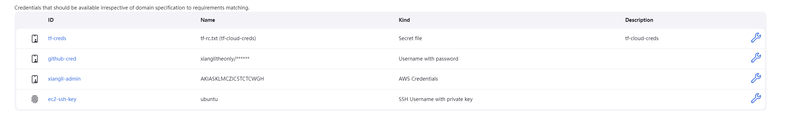

## Project Description

Deploy Grafana and Prometheus to AWS EC2 instances automatically with Terraform, Ansible and Jenkins.

## Dockerfile

* The Dockerfile is used to build a customized Jenkins docker image that will be installed with the required
environments inluding AWS CLI, Terraform, Ansible and JQ.
* The basic image and running guide could be found at
https://www.jenkins.io/doc/book/installing/docker/#on-macos-and-linux

## Jenkins
* A multi-branch pipeline is used to automatically run Terraform apply and Ansible deploy.
* The public ssh key used to create the EC2 instances should be put in the docker volume called jenkins-docker-certs.
* All the credentials are stored in Jenkins credentails. There are tf-creds for Terraform cloud, github-cred for github
personal access, xiangli-admin for AWS CLI access, ec2-ssh-key for the ssh private key.

## Terraform

* Terraform cloud is used for Terraform state backend.
* Resources that Terraform will create include AWS VPC, subnets, rout tables, internet gateway, security groups and EC2 instances.
* With several .tfvars files for different environments.

## Ansible

* Two Ansible playbook files will be used. One for Grafana and Prometheus deployment and one for applications test
for ensuring the deployment is successful.
* There is no ansible.cfg file for configuration because it will be using the build-in function in Jenkins ansiblePlaybook() to specify the inventory file.
* The other configurations could be specified using Ansible environment variables at the top of the Jenkinsfile.